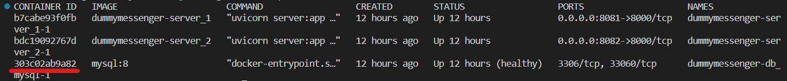

# DummyMessenger  
## О проекте  
Проект представляет из себя тестовое задание по написанию сервера, который будет обрабатывать POST-запросы и клиента, который будет отправлять запросы и тестировать пропускную способность сервера.

## Требования
Для запуска проекта на ОС Windows 10 требуется установить [Docker Desktop](https://docs.docker.com/desktop/install/windows-install/) и [Python 3.11.4](https://www.python.org/downloads/release/python-3114/) а также иметь интернет-подключение достаточной скорости чтобы сделать пулл докер-изображений и установить зависимости.

### Используемые docker-изображения
* [MySQL](https://hub.docker.com/_/mysql/)
* [Python](https://hub.docker.com/_/python)

### Используемые порты
Приложение использует следующие порты на localhost:

| Server      | Port |
|-------------|------|
| MySQL       | 3306 |
| Server 1    | 8081 |
| Server 2    | 8082 |

## Установка проекта  
Скачайте проект с помощью [Git](http://git-scm.com/book/en/v2/Getting-Started-Installing-Git):

```sh
git clone https://github.com/ngumbk/DummyMessenger.git
```

Чтобы попасть в директорию проекта, выполните следующую команду:

```sh
cd DummyMessenger
```

Для создания виртуальной среды и установки зависимостей выполните следующую последовательность команд:

```sh
virtualenv [-p {путь_к_питону}] venv
./venv/Scripts/activate
python -m pip install -r requirements.txt
```

После установки Docker и зависимостей проект можно запускать.

## Запуск проекта
1. Запуск контейнеров с БД и 2 копиями веб-сервера:

    ```sh
    docker-compose up -d
    ```

    Если хотите отслеживать логи в этом же или другом терминале:

    ```sh
    docker-compose logs -f
    ```

2. Запуск клиента:  

    ```sh
    python client.py
    ```

### Остановка проекта
Чтобы остановить проект выполните следующую команду:

```sh
docker-compose down -v
```

## Возможные проблемы с запуском
### Сервер БД не успел запуститься
Возможна такая ситуация, что на вашем ПК docker-контейнер с MySQL Server запустится быстрее или медленнее, что повлечет за собой ошибку серверов, которую вы сможете отследить по логам docker-compose.  

В таком случае в docker-compose.yml увеличьте *interval* в поле *healthcheck* сервиса db_mysql примерно на то время, на которое вам нужно отсрочить запуск контейнеров с бэкенд-серверами.
```yml
...
    healthcheck:
      test: ["CMD", ...]
      timeout: 1s
      interval: 40s # Здесь добавьте ~10 секунд
      retries: 5
...
```
После внесения изменений перезапустите docker-compose.

## Проверка программы
Проверку можно произвести после успешного завершения работы клиента.

### Скрипт для проверки
Для проверки корректности работы сервера был написан скрипт test.py, который можно запустить следующей командой:
```sh
python test.py
```
Скрипт проверяет следующее:
 - Правильность последовательности сообщений в ответе на запрос к серверу;
 - Соответствие общего количества записей с общим количеством записей с уникальным id (проверка уникальности каждого id);
 - Наличие сообщений с неуникальными user_messages_count для каждого отправителя;

В случае, если какая-то проверка не была пройдена, скрипт показывает проверяемые значения и те значения, которые оказались неправильными.

### Ручная проверка записей БД
#### Подключение к оболочке БД
Чтобы подключиться к оболочке БД, необходимо узнать id контейнера, в котором она запущена. Для вывода информации о запущенных контейнерах, выполните следующую команду.
```sh
docker ps
```
В результате вы увидите следующий вывод в терминале:  



Красной чертой подчеркнут id контейнера с MySQL-сервером. Для подключения к оболочке контейнера вставим этот id в следующую команду.

```sh
docker exec -it [id контейнера] mysql -u root -p 
```
Далее оболочка потребует ввести пароль для дальнейшего доступа. Для пользователя **root** пароль будет *root*.

#### Запросы к БД для проверки
**Вывод всех записей:**
```sql
SELECT * FROM Messages;
```

**Проверка общего количества записей (при единственном запуске client.py должно быть 5001):**
```sql
SELECT COUNT(*) FROM Messages;
```

**Проверка уникальности значений поля ID (должно быть 5001):**
```sql
SELECT COUNT(DISTINCT message_id) AS unique_ids FROM Messages;
```

**Проверка отсутствия совпадений значений счетчиков сообщений для каждого пользователя (значения запросов должны совпадать):**
```sql
SELECT COUNT(*) AS msgs_from_user FROM Messages WHERE sender_name = '[имя отправителя]';
```
```sql
SELECT COUNT(DISTINCT sender_name, user_messages_count) AS msgs_with_unique_n FROM Messages WHERE sender_name = '[имя отправителя]';
```

**Если все-таки счетчики не совпадают, то посмотреть конкретные id записей с дублированным полем user_message_count можно с помощью следующего запроса:**
```sql
SELECT *
FROM Messages
WHERE sender_name = '[имя отправителя]' AND user_messages_count IN (
    SELECT user_messages_count
    FROM Messages
    WHERE sender_name = '[имя отправителя]'
    GROUP BY user_messages_count
    HAVING COUNT(*) > 1
);
```

### Сторонняя проверка ответов на запросы
В случае, если функциональности скрипта недостаточно для полноценной проверки, вы можете проверить ответы на запросы к серверу с помощью своего ПО.
После работы клиента все ответы сохраняются в файл *responses.json*.